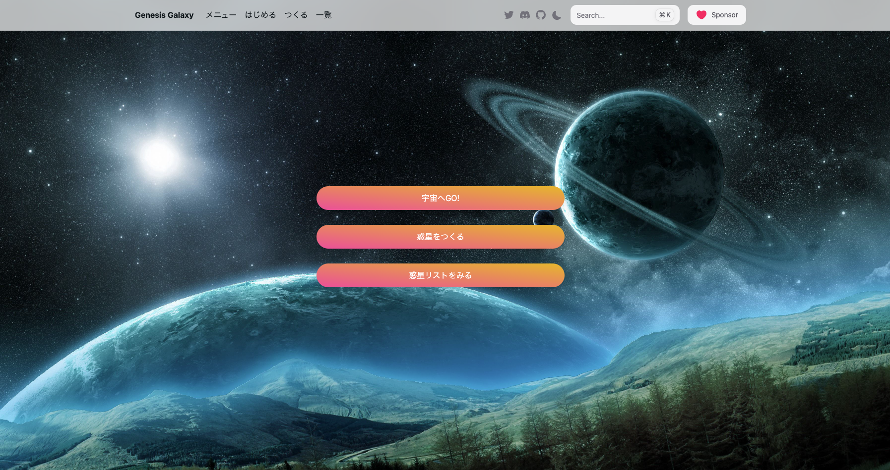
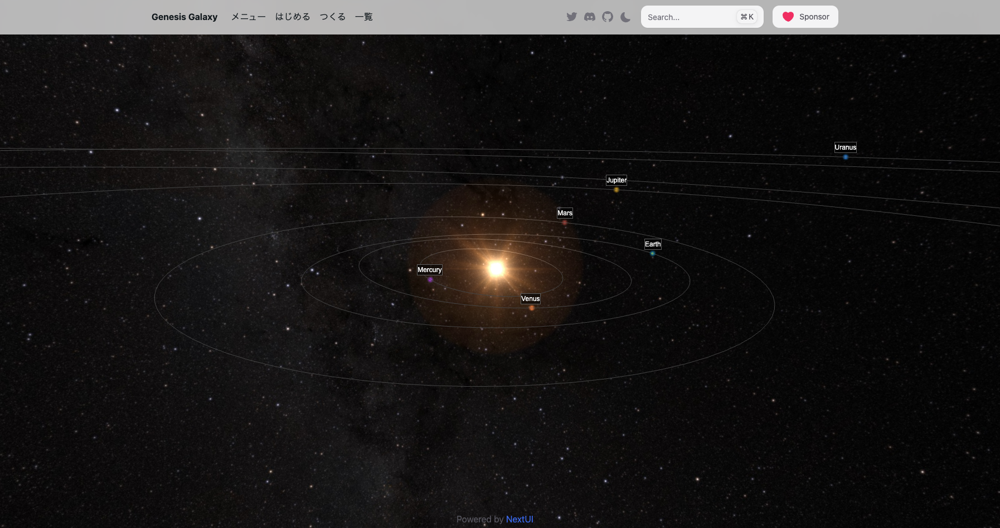
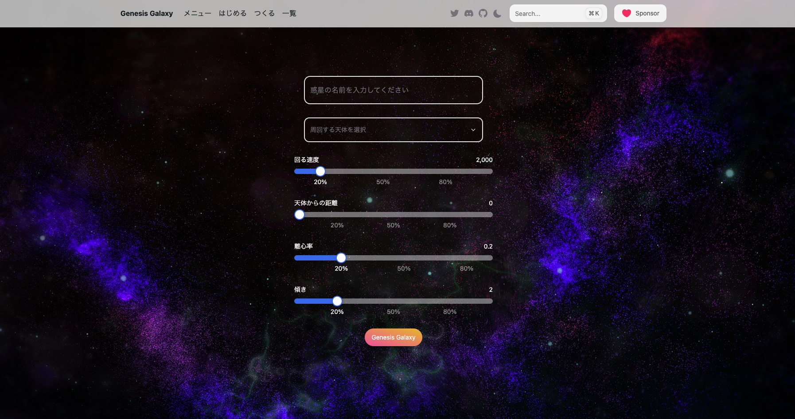
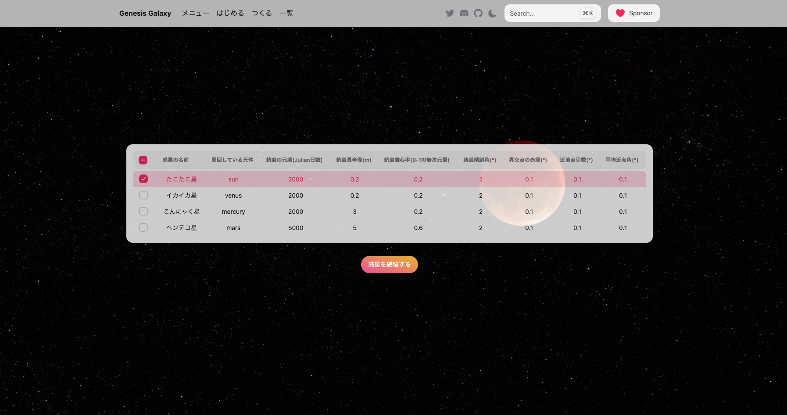
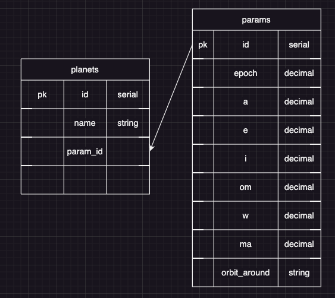

# other-language

## アプリ概要

<dl>
    <dt>アプリ名</dt>
    <dd>Genesis Galaxy</dd>
    <dt>アプリ紹介</dt>
    <dd>宇宙を旅するアプリです。</dd>
    <dd>あなたは自由に惑星を誕生させることができます。</dd>
    <dd>自分だけの銀河を作りましょう。</dd>
    <dt>アプリデモ画面</dt>
    <dd>メニュー</dd>
    <dd></dd>
    <dd>メイン画面</dd>
    <dd></dd>
    <dd>惑星をつくる</dd>
    <dd></dd>
    <dd>惑星一覧</dd>
    <dd></dd>
</dl>

## アプリ使用方法

```
1.ソースをクローンする
2.gradlewを実行
3.http://localhost:8080 にアクセス
```

## データベースの構成



### パラメータの説明

<li>epoch: 軌道の元期または時刻。通常はJulian日数で表されます。</li>
<li>a: 軌道長半径 (Semi-major axis)。単位はメートルです。</li>
<li>e: 軌道離心率 (Eccentricity)。単位なしで、0から1の間の値を取ります。</li>
<li>i: 軌道傾斜角 (Inclination)。度数法で表されます。</li>
<li>om: 昇交点の赤経 (Longitude of the ascending node)。度数法で表されま</li>す。
<li>w: 近地点引数 (Argument of perigee)。度数法で表されます。</li>
<li>ma: 平均近点角 (Mean anomaly)。度数法で表されます。</li>
<li>orbit_around: 周回する天体。</li>

## 使用技術

### フロントエンド

<li>HTML</li>
<li>CSS</li>
<li>Type Script</li>
<li>React</li>
<li>Vite</li>
<li>tailwind.css</li>
<li>NextUI</li>
<li>Spacekit.js</li>

### バックエンド

<li>kotlin</li>
<li>Spring boot</li>

### データベース

<li>PostgreSQL</li>
